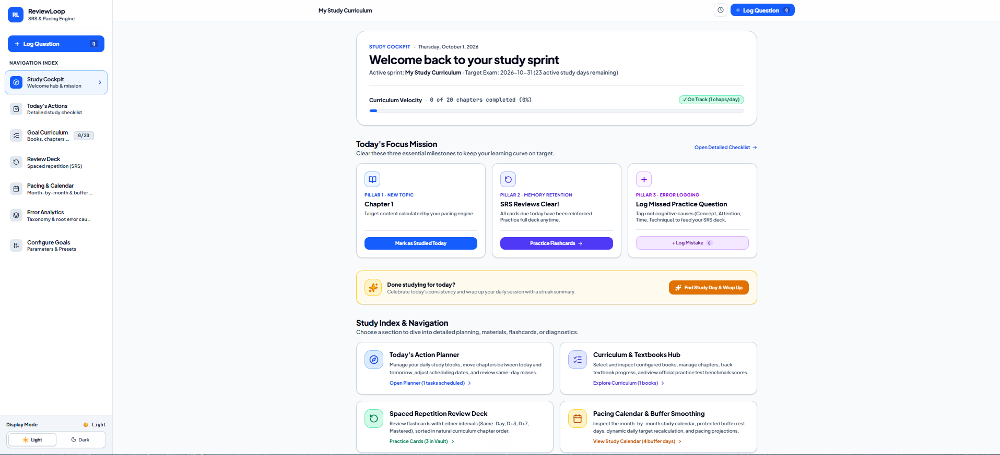

# ReviewLoop

A study pacing and spaced repetition system (SRS) with cognitive error tracking for exam preparation.

[](LICENSE)
[](https://react.dev)
[](https://www.typescriptlang.org/)
[](https://tailwindcss.com)
[](https://vitejs.dev)

---

## Overview

ReviewLoop is a client-side web application designed to help learners manage study schedules, track practice question performance, and review mistakes using spaced repetition.

The application calculates required daily study units based on a target completion date and a customizable buffer percentage. It tracks errors using a four-category cognitive taxonomy (Theory, Attention, Calculation, Time) and schedules reviews using a modified Leitner box algorithm.

---

## Demo

[](https://youtu.be/u4klgscQEho)

Full walkthrough (about 4 minutes) click in the image to see the video.

---
## Features

- **Pacing Engine:** Calculates daily unit quotas (chapters, pages, lessons, modules) from a start date, end date, active study weekdays, and buffer percentage.
- **Spaced Repetition (SRS):** 4-stage Leitner queue (`SAME_DAY`, `INTERVAL_3`, `INTERVAL_7`, `GRADUATED`) with daily review capacity limits to prevent backlog accumulation.
- **Cognitive Error Taxonomy:** Categorizes incorrect answers into Theory, Attention, Calculation, or Time, with support for custom sub-tags.
- **Curriculum Management:** Organize study resources by subject, assign high-yield topic weights, and track completed units.
- **Mock Exam Logging:** Record practice test results using percentage, raw points, or scaled scores, with optional section-by-section score breakdowns.
- **Analytics View:** Summary metrics showing error distribution by cognitive category and subject, along with export options.
- **Focus Timer:** Built-in Pomodoro/stopwatch timer for study sessions.
- **Data Export & Import:** Export data as JSON, CSV, or Anki-compatible TSV files. Data is stored in browser `localStorage`.
- **Theme Support:** Light and dark mode interface.

---

## Tech Stack

- **Frontend:** React 19, TypeScript
- **Styling:** Tailwind CSS v4
- **Icons:** Lucide React
- **Date Utilities:** date-fns
- **Animation & Effects:** Motion, canvas-confetti
- **Build Tool:** Vite

---

## Getting Started

### Prerequisites

- Node.js 20.19+
- npm

### Installation

1. Clone the repository:
   ```bash
   git clone https://github.com/mariokassow/reviewloop.git
   cd reviewloop
   ```

2. Install dependencies:
   ```bash
   npm install
   ```

3. Start the development server:
   ```bash
   npm run dev
   ```

4. Build for production:
   ```bash
   npm run build
   ```

---

## Project Structure

```text
reviewloop/
├── .cursorrules              # IDE configuration rules
├── AI_BOOTSTRAP_PROMPT.md    # Reference context prompt for AI code editors
├── .env.example              # Environment variables template
├── LICENSE                   # MIT License
├── package.json              # Project scripts and dependencies
├── src/
│   ├── App.tsx               # Root component and main application state
│   ├── main.tsx              # Entry point
│   ├── index.css             # Tailwind CSS entry point
│   ├── types/
│   │   └── index.ts          # TypeScript type definitions
│   ├── lib/
│   │   ├── demoData.ts       # Initial empty state definitions
│   │   ├── pacingEngine.ts   # Pacing and buffer calculations
│   │   ├── srsEngine.ts      # Spaced repetition scheduling logic
│   │   ├── storage.ts        # Browser localStorage read/write and file export
│   │   ├── subjectUtils.ts   # Subject color mapping and score formatting
│   │   └── theme.tsx         # Theme context provider (light/dark)
│   └── components/           # React UI components and modals
└── vite.config.ts            # Vite build configuration
```

---

## Data & Privacy

Your study data never leaves your browser; it is stored in localStorage. No data is transmitted to external servers. You can export a full JSON backup of your data at any time from the Error Analytics view.

---

## Meta

- **Author:** Mario Kassow
- **Note:** AI-assisted, built in Google AI Studio
- **Status:** v1.0, last updated October 2026, not actively maintained
- **License:** MIT (see [LICENSE](LICENSE))
